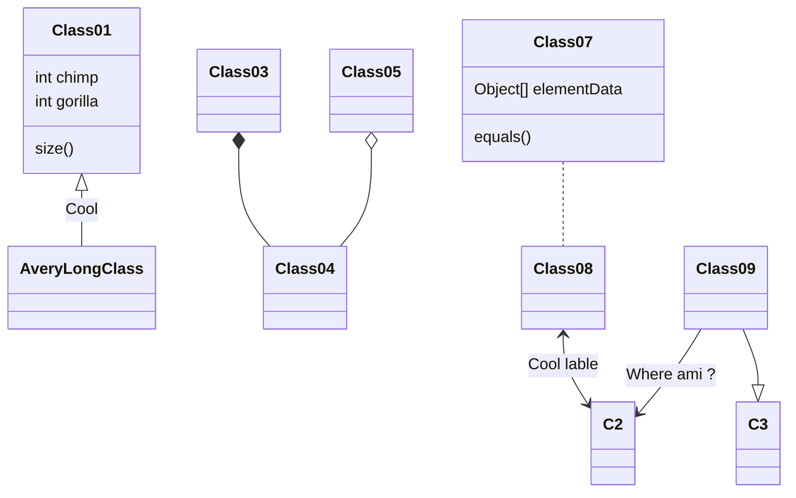
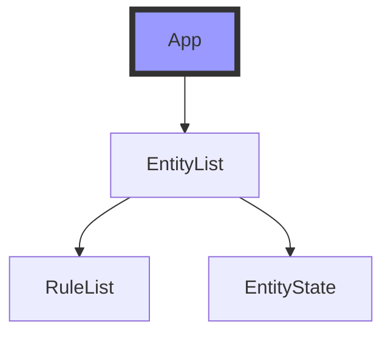

<center> <font face="楷体" size=6 color=red> 标题居中 字体 字体大小 字体颜色 </font> </center>

[Markdown语法](https://zhuanlan.zhihu.com/p/409411268)

[linux 硬件信息查询](https://zhuanlan.zhihu.com/p/400027233)

[markdown语法整理](https://guo365.github.io/study/Markdown.html)

**[NVIDIA 自动检测脚本](./nvidia.md)**

**[Kubernetes](./day1.md)**

**[heml](./helm%20install.md)**

**[Heml](./Helm%E5%B8%B8%E7%94%A8%E5%91%BD%E4%BB%A4%E9%9B%86.mm.md)**

**[Kubernetes](./tools.md)**

**[前端开发库](https://v5.bootcss.com/)**

## 自动生成左侧导航栏方法
+ 1、把markdown文件导出为html文件，在使用编辑器打开，在最头或者最尾加上[链接中的代码等待1分钟左右](https://blog.csdn.net/jk418756/article/details/89213832)即可生成目录如下图

## 实现瞄点功能

[实现瞄点功能](https://blog.csdn.net/weixin_45844049/article/details/103866977)

[markdown功能](https://www.cnblogs.com/dotnetcrazy/p/9180295.html#divtop)

## VS code 配置 markdown + PPT写作配置指南

## VScode 插件

[Pandoc 通用文档转换器](https://www.pandoc.org/index.html)
  
[marp markdown编写PPT插件 ](https://marp.app/)

[Slidev PPT插件](https://cn.sli.dev/guide/)

+ Markdown All in One
    - 支持表格格式化Alt+Shift+f
+ Paste Image: vscode 粘图插件 快捷键  CTRL+Alt+v
+ Markdown Preview Enhanced


+ Atom One Dark Theme 主题颜色
+ Live Server
+ markmap 思维导图
+ Vscode Blink Mind 思维导图
  - 只支持 保存为 .blinkmind 和 .bm 后缀文件
+ vscode-mindmap 脑图 
  - 文件保存后缀.km会自动显示或者用快捷键ctrl/cmd + m显示, 
+ PlantUML 时序图
  - 文件后缀名*.pu, *.puml结尾,同时，还必须安装：Java 环境和Graphviz-Dot才能使用

## 使用标准字体
<font face="黑体">我是黑体字</font>

<font face="微软雅黑">我是微软雅黑</font>

<font face="STCAIYUN">我是华文彩云</font>

## 表格

| 表头 | 左对齐--- | 居中  | ---右对齐 |
| ---- | :-------- | :---: | --------: |
| 参数 | 参数      | 参数  |      参数 |


## 引用
>一
>>二
>>>三


## 图标快捷键显示
使用 <kbd>Ctrl</kbd>+<kbd>Alt</kbd>+<kbd>Del</kbd> 重启电脑

## 复选框
- [x] 选择
- [ ] 未选择

## 代码块

```bash
echo "Hello World!"
```

```python
print(hello world!)
```

## 分割线
---


# markdown js语法

[Mermaid 中文](https://github.com/mermaid-js/mermaid/blob/develop/README.zh-CN.md)
[Mermaid 英文](https://mermaid-js.github.io/mermaid/#/)

# 思维导图，时序图

[Plantunl](https://plantuml.com/zh/)

# 思维导图

[Drawio](https://app.diagrams.net/)

# JS饼图

[ECharts](https://echarts.apache.org/handbook/zh/get-started/)

[一款面向程序员的 Markdown 笔记应用](https://github.com/purocean/yn/blob/develop/README_ZH-CN.md)


## 设置图像的长宽


## 定义尺寸


## 定义大小并剧中显示
<div align=center></div>

## 插入图像


## 插入音乐
<iframe frameborder="no" border="0" marginwidth="0" marginheight="0" width=330 height=86 src="//music.163.com/outchain/player?type=2&id=528478901&auto=1&height=66"></iframe>

## 插入视频
> 不支持优酷，可以用youtube
> 
<iframe width="560" height="315" src="https://v.qq.com/x/cover/mzc00200ets769l/j0042w9d0xy.html?n_version=2021" frameborder="0" allowfullscreen></iframe>

> 插入Gif必须是在线https://的gif 本地路径的gif无法显示 
> 可以把本地的Gif上传到一个https://giphy.com/join?next=/create/gifmaker 网站上复制连接即可使用gif动图

<iframe width="560" height="315" src="https://www.xxxgit" frameborder="0" allowfullscreen></iframe>

## 超链接
[百度网址](https://www.baidu.com)

## 跳转链接
<a href="https://www.cnblogs.com/MeiCheng/" target="_blank">跳到自己博客列表</a> 跳到自己博客列表：<a href="https://www.cnblogs.com/MeiCheng/"target="_blank">https://www.cnblogs.com/MeiCheng/</a>


### 时序图

> 需要安装 PlantUML并配置本地环境才能使用
```PlantUML
@startuml test
== build ==
Main -> Builder: createEntity()
Builder -> EntityFactory: create()
EntityFactory -> Entity: constructor()
== run ==
Main -> Main: update()
Main -> Entity: update()
Entity -> Entity: render()
Entity -> Entity: emitEvent(EVENT_RENDER)
Entity --> Main: onRender()
@enduml
```


## 类图
> 需要安装 PlantUML并配置本地环境才能使用
```
@startuml test

Class ClassA {
    -- 属性 --
    +String publicAttr
    #int protectedAttr
    -long privateAttr
    .. 其他格式 ..
    +A: String
    #B: Number
    -C: Boolean
    == 方法 ==
    +getAttr()
    #setAttr()
    -readAttr()
}

note top: 在顶部注释说明

Class ClassB {

}

note right: 在右边注释说明

ClassA <-- ClassB:关联
ClassA <.. ClassB : 依赖
ClassA o-- ClassB:聚集
ClassA <|-- ClassB:泛化
ClassA <|.. ClassB:实现
@enduml
```


## 多种矩阵形式输入
$$\begin{matrix}
1&2 \\  3&4 \\ 5&6
\end{matrix}
$$

# 带大括号的：
$$\left\{
\begin{matrix}
1&2 \\  3&4 \\ 5&6
\end{matrix}
\right\}
$$

## 带中括号的

$$\left[
\begin{matrix}
1&2 \\  3&4 \\ 5&6
\end{matrix}
\right]
$$


## 绘制流程图 Flowchart
```flow
st=>start: Start
e=>end: 需求变更备案
op1=>operation: 需求基线确定|past
op2=>operation: 内部需求变更|current
op3=>operation: 下一个版本|current
op4=>operation: 与客户协商需求变更|current
op5=>operation: 更新需求文档|current
op6=>operation: 通知项目组开发和测试|current
op7=>operation: 客户需求变更流程|current
 
 
 
cond1=>condition: 是否对实际业务产生影响
cond2=>condition: 是否接受当前版本变更
 
st->op1(right)->op1(right)->op2->cond1
cond1(no)->cond2
cond1(yes)->op4->op7
cond2(yes)->op5
cond2(no)->op3
op5->op6
op6->e
```


## mermaid 





